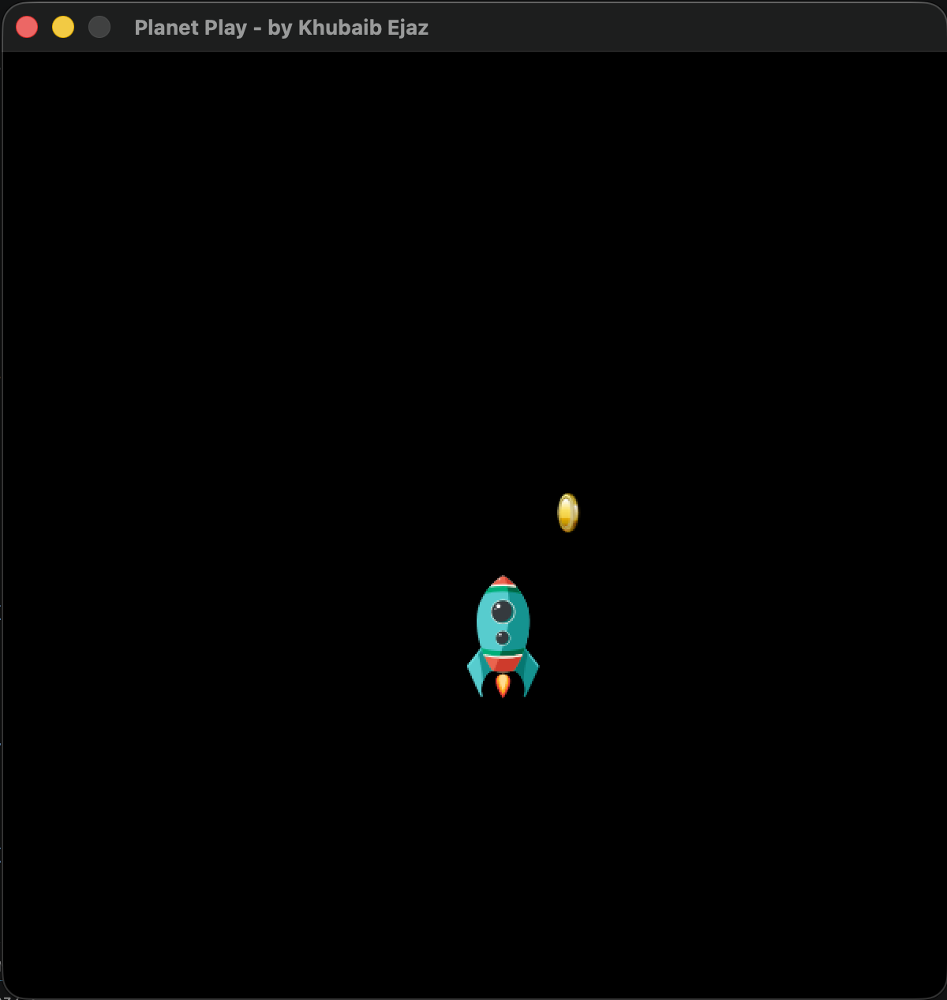

# Planet Play

Planet Play is a space game built with C++ and SplashKit. You pilot a ship
through space using the arrow keys — the foundation for a game I build up
feature by feature across the project's history.

I built this during my first year of Computer Science while learning C++ and the
SplashKit graphics library. Rather than writing it all at once, I put it together
in stages — each commit adds one new concept, working up from basic movement
through structs, dynamic arrays, and classes — so the history shows both the game
and my understanding growing over time.



## How it works

- The ship and coin are loaded from a SplashKit resource bundle.
- The arrow keys move the ship around the window.
- A spinning coin sits at a random spot — steer into it and it hops to a new one.
- The screen clears and redraws at 60 frames per second.

## Controls

| Input | Action |
|-------|--------|
| Arrow keys | Move the ship |
| Close window | Quit |

## Development log

The game is built as a series of commits, each adding one idea on top of the last:

- **Flying ship** — load a ship bitmap and move it around the window with the arrow keys.
- **Collectible coin** — a spinning coin that jumps to a new random spot each time the ship touches it.
- **Cleaner structure** — split the game loop into separate input, update, and drawing functions.

## Built with

- **C++**
- **SplashKit** — used for the window, drawing, and keyboard input

## Running it

You'll need [SplashKit](https://splashkit.io) installed. From inside this folder,
compile the game:

```bash
skm clang++ planet-play.cpp -o planet-play
```

Then run it:

```bash
./planet-play
```

> On Windows or Linux you may use `skm g++` instead of `skm clang++`.

## Files

| File | Purpose |
|------|---------|
| `planet-play.cpp` | Main game — the loop, ship movement, and drawing |
| `Resources/` | Ship image, coin animation, and the SplashKit resource bundle |